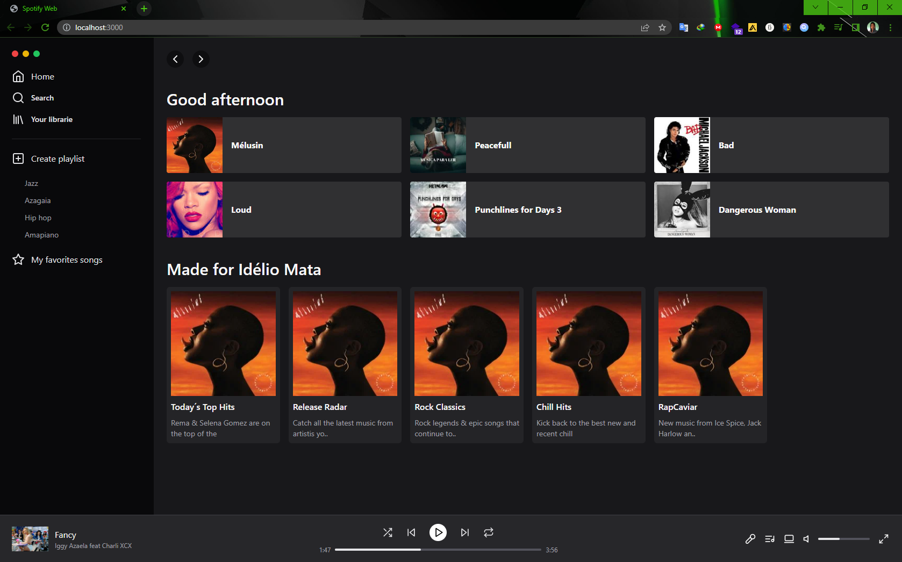

# Spotify_Frontend

This is a simple Spotify frontend. 

In this small project, I had my first contact with tailwind, I used tailwind as CSS...

Tailwind is a CSS framework that provides a catalog of custom style classes to quickly style our htm avoiding the user to write long codes.

Take a look and check out the small demonstration of the projects I've worked on.

 
>[Clique here to see](https://mylinkshare.netlify.app/)

 
 ## About

Essa é uma pagina estática.

  Não possui nenhuma interatividade por hora.
  
  Mas representa fielmente a estrutura de uma das várias telas presentes no spotify web.

    

  
##  Technology
  - Next.Js
  - HTML.TSX
  - Tailwind Css
  - Git e Github

## Contacto
<idelioteofilomata@gmail.com>

[linkedin](https://www.linkedin.com/in/id%C3%A9liote%C3%B3filomata/)
